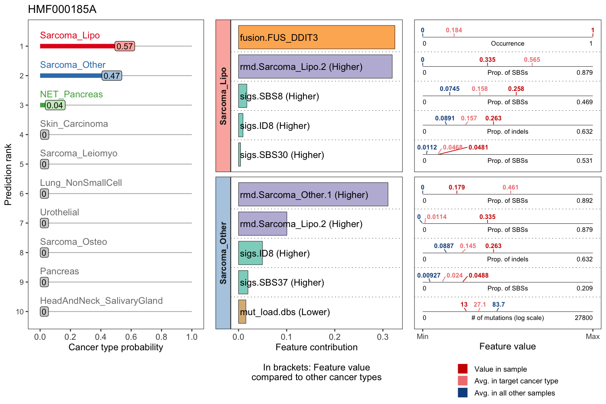

CUPLR is a classifier for identifying the primary tumor location of metastatic tumors based
on features derived from whole genome sequencing data. The model itself is an ensemble of binary
random forest classifiers which each predict the probability of one cancer type. The final predicted
cancer type is the one with the highest probability.

The features used by CUPLR are extracted from the output of the [HMF pipeline](https://github.com/hartwigmedical/pipeline5),
specifically from: (i) the somatic VCF file containing SBS, DBS and indel mutations, 
(ii) [PURPLE](https://github.com/hartwigmedical/hmftools/tree/master/purple) (v2.53) output, and 
(iii) [LINX](https://github.com/hartwigmedical/hmftools/tree/master/sv-linx) (v1.14) output. Below 
is a summary of the features.

Feature type  | Source | Description
------------- | ------ | --------
sigs          | VCF    | Relative contribution of SBS, DBS and indel [mutational signatures](https://cancer.sanger.ac.uk/signatures/)
mut_load      | VCF    | Total number of SBSs, DBSs and indels
rmd           | VCF    | Signatures extracted (by NMF) on 1Mb [regional mutational density (RMD)](https://www.nature.com/articles/nature14221) bins
kataegis      | VCF    | Counts of kataegis foci
chrom_arm     | PURPLE | Chromosome arm gains/losses compared to the overall genome ploidy
gender        | PURPLE | Gender as derived from copy number data
gene          | LINX   | Deep deletions, amplifications, biallelic losses and mutations of cancer associated genes
sv            | LINX   | Simple and complex structural variants
fusion        | LINX   | Presence of gene fusions
viral_ins     | LINX   | Presence of viral sequence insertions


CUPLR was trained with tumor samples from ~6100 patients from the Hartwig Medical Foundation (HMF)
and the Pan-Cancer Analysis of Whole Genomes (PCAWG) consortium. The model can predict the primary 
tumor location with an accuracy of ~0.89. Performance was assessed by 15-fold cross-validation as 
well as on a held out set of 680 samples.

For details on performance, the top features used by CUPLR, and other details, please see the plots 
at `doc/perf/`.

# Installation
## Dependencies
CUPLR depends on several R packages for basic functionality. These can be installed as follows:
```{r eval=FALSE, error=FALSE}
install.packages(c('randomForest','reshape2'))

## For calculating random forest feature contributions:
install.packages('rfFC', repos='http://R-Forge.R-project.org')

## For reading VCFs and extracting mutational signatures:
install.packages('devtools')
devtools::install_github('https://github.com/UMCUGenetics/mutSigExtractor/')
```

Certain functions require other R packages (e.g. ggplot2 for plotting). For details on optional 
dependencies, please see the DESCRIPTION files.

## Loading CUPLR
CUPLR is composed of the following R packages:

* `cuplr`: random forest training, prediction, and performance
* `featureExtractor`: extract the features used by CUPLR
* `statsExtra`: statistics used for univariate feature selection for training CUPLR
* `nmf`: wrapper around the NNLM package for non-negative matrix factorization for generating 
RMD signatures

To download CUPLR, run the following commands in the terminal:
```
cd /working/dir/
git clone https://github.com/UMCUGenetics/cuplr/
```

Then load the `featureExtractor`, `cuplr`, and `mutSigExtractor` packages. The remaining CUPLR 
packages (`statsExtra` and `nmf`) are only needed for training CUPLR.
```{r eval=FALSE, error=FALSE}
cuplr_dir <- '/path/to/cuplr/'
devtools::load_all(paste0(cuplr_dir,'/featureExtractor/')
devtools::load_all(paste0(cuplr_dir,'/cuplr/')
```

```{r error=FALSE, message=FALSE, echo=FALSE}
cuplr_dir <- '/Users/lnguyen/hpc/cuppen/projects/P0013_WGS_patterns_Diagn/CUPs_classifier/processed/cuplr/'
devtools::load_all(paste0(cuplr_dir,'/featureExtractor/'))
devtools::load_all(paste0(cuplr_dir,'/cuplr/'))
```

# Using CUPLR
This tutorial will demonstrate how cancer type prediction can be performed using example input files
located at `doc/data/`. These are 3 primary tumor samples from the PCAWG consortium, whose BAM files
were analyzed with the HMF pipeline.

## Extracting features
Extraction of features per sample is performed using `extractFeaturesCuplr()`. 

### Method 1
Paths to the required input files can be provided to `input.paths` as a named character vector. 
Make sure that this vector has the names shown below. The below code will return a 1-row dataframe 
with the values for each feature.

```{r, message=FALSE, warning=FALSE}
sample_dir <- paste0(cuplr_dir,'/doc/data/DO48977/')
features <- extractFeaturesCuplr(
   input.paths=c(
      purple.smnv=        paste0(sample_dir,'/DO48977T.purple.somatic.vcf.gz'),   ## *.purple.somatic.vcf.gz
      purple.cnv=         paste0(sample_dir,'/DO48977T.purple.cnv.somatic.tsv'),  ## *.purple.cnv.somatic.tsv
      purple.purity=      paste0(sample_dir,'/DO48977T.purple.purity.tsv'),       ## *.purple.purity.tsv
      linx.drivers=       paste0(sample_dir,'/DO48977T.linx.driver.catalog.tsv'), ## *.linx.driver.catalog.tsv
      linx.fusions=       paste0(sample_dir,'/DO48977T.linx.fusion.tsv'),         ## *.linx.fusion.tsv
      linx.viral.inserts= paste0(sample_dir,'/DO48977T.linx.viral_inserts.tsv'),  ## *.linx.viral_inserts.tsv
      linx.vis.sv.data=   paste0(sample_dir,'/DO48977T.linx.vis_sv_data.tsv')     ## *.linx.vis_sv_data.tsv
   )
)
features[,1:5]
```

### Method 2
Alternatively, the path to a folder with all the required input files can be provided to `in.dir`.
The filenames should end with those shown in the comments and the above example 
(e.g. *.purple.somatic.vcf.gz).

An output folder can optionally be specified to `out.dir`. With this approach, intermediate files
are also written and allows resuming the feature extraction if a crash occurs (instead of starting
the extraction from the beginning).

For this tutorial, we will use `in.dir` and `out.dir` to load the example input data and write the 
outputs. The below code extracts the features for all 3 example samples.

```{r, message=FALSE, warning=FALSE}
sample_dirs <- list.dirs(paste0(cuplr_dir,'doc/data/'), recursive=F, full.names=T)

for(in_dir in sample_dirs){
   message('\nExtracting features at: ', in_dir)

   out_dir <- paste0(in_dir,'/output/')
   dir.create(out_dir, showWarnings=F)

   extractFeaturesCuplr(
      in.dir=in_dir, ## Provide `input` to in.dir instead of `input.paths`
      out.dir=out_dir,
      verbose=1
   )
}
```

We can then read the `all_features.txt.gz` files which are the 1-row dataframes (as mentioned 
above). It is important to specify `check.names=F` to `read.delim()` as the column names have some
illegal characters which would otherwise be modified, and we don't want this to happen.

```{r, message=FALSE, warning=FALSE}
out_paths <- paste0(sample_dirs,'/output/all_features.txt.gz')

## Read txt files
features <- lapply(out_paths, function(i){ 
   read.delim(i, check.names=F) 
})

## Merge 1-row dataframes into a single dataframe
features <- do.call(rbind, features)

## Assign sample names to rownames
sample_names <- basename(sample_dirs)
rownames(features) <- sample_names
features[,1:5]
```

### Summary of feature names
There are 4000+ features; too many to print on screen. However, with below code we can see the names 
of the first couple of features in each group.

```{r, message=FALSE, warning=FALSE}
feature_groups <- groupFeaturesByTag(colnames(features), rm.tags=F)
lapply(feature_groups, head)
```

## Predicting cancer type
Now that we have the features, we can predict the cancer type. We first need to load CUPLR itself
as well as the probability calibration curves. 

The scores outputted by a random forest need to be calibrated to yield true probabilities. This 
means that a probability of 0.9 should mean that for example: amongst 100 hypothetical samples 
predicted as breast cancer, 90 of them are actually breast cancer. In other words, true 
probabilities map directly to the accuracy of the prediction. For more info, see 
the [scikit-learn documentation](https://scikit-learn.org/stable/modules/calibration.html) about 
this topic.

```{r, eval=FALSE, message=FALSE, warning=FALSE}
model <- readRDS(MODEL_PATH)
prob_cal_curves <- read.delim(PROB_CAL_CURVES_PATH)
```

```{r, echo=FALSE, message=FALSE, warning=FALSE}
## Execute this!
model <- cacheAndReadData(MODEL_PATH, overwrite=T)
prob_cal_curves <- read.delim(PROB_CAL_CURVES_PATH)
```

We can then use `predict()` to get the probabilities of each cancer type for each sample. The output
of `predict()` is a list containing several objects. Here we have specified `calc.feat.contrib=T`
which will calculate the contribution of each feature to each cancer type prediction. This is
required to generate the patient report (see next section).
```{r, message=FALSE, warning=FALSE}
pred_report <- predict(
   object=model,
   newdata=features,
   prob.cal.curves=prob_cal_curves,
   calc.feat.contrib=T
)
pred_report
```
However, the above raw prediction output is not informative at a glance. We can use `summary()` to
show the prediction in a neat table.

```{r, message=FALSE, warning=FALSE}
summary(
   pred_report, 
   top.n.classes=3, ## Optional: Shows the top 3 classes and their probabilities
   top.n.feat=3     ## Optional: Shows the top 3 features contributing to the top class prediction
)
```

## Graphical patient report
Using `patientReport()` we show plot the output of CUPLR graphically for one patient. The left panel
of the patient report shows the cancer type probabilities. The right panels show the values of the
most important features contributing to each of the top predicted cancer types.

In the right panels, the feature value averages in patients with the respective predicted cancer
type and patients with other cancer types are also shown to provide context to the feature values of
the patient. For numeric features, (e.g. SNV mutational load) the average refers to the
interquartile mean. For boolean features, (e.g. presence of a gene fusion) the average refers to the
proportion of patients with the feature, with the patient feature values of 0% and 100% indicating
absence/presence respectively.

```{r, message=FALSE, warning=FALSE}
patient_report <- patientReport(
   probs=pred_report$prob_scaled, 
   feat.contrib=pred_report$feat_contrib, 
   sample.name='DO36021',
   rel.widths=c(1.4, 1) ## Adjusts the relative width of the plot panels
)
```

```{r, message=FALSE, warning=FALSE, echo=FALSE}
if(F){
   png(paste0(cuplr_dir,'/doc/supp/patient_report_example.png'), 1200, 900, res=150)
   plot(patient_report)
   dev.off()   
}
```

```{r eval=FALSE}
plot(patient_report)
```



Here we can see that DO36021 is a pilocytic astrocytoma cancer sample and we can see that this
sample was correctly predicted as such. The prediction is supported by this sample having a
KIAA1549-BRAF fusion, a well-known event in this cancer type.

We can also see that there are two high probabilities. In cases where the probabilities are more 
uncertain (like as shown here), more feature contribution panels corresponding to the top predicted 
classes will be shown. This should aid in determining the cancer type, since it's possible that e.g.
the 2nd predicted cancer type better matches with evidence from pathology.


